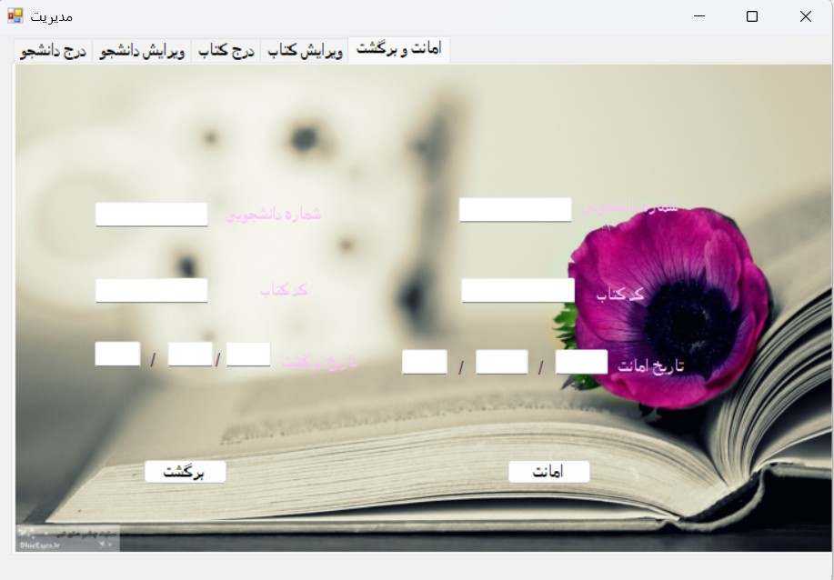
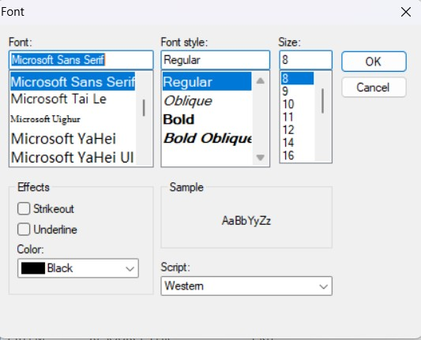

# 📚 Library Management System

A desktop-based **Library Management System** developed using .NET (Windows Forms).
This application provides functionalities for managing books, students, and borrowing operations.

---

## 🚀 Features

* 📖 Borrowing and returning books
* ➕ Insert new books
* 👤 Add new students
* ✏️ Edit book information
* 🧑‍🎓 Edit student profiles
* 🎨 Customize UI font settings

---

## 🖼️ Application Screenshots

### 📖 Borrowing & Returning Books



---

### ✏️ Edit Book


---

### 🧑‍🎓 Edit Student Profile


---

### ➕ Insert New Book


---

### 👤 Insert Student


---

### 🎨 Font Settings



---

## 🛠️ Technologies Used

* C# (.NET Framework)
* Windows Forms
* Visual Studio

---

## ▶️ How to Run

```bash
# Clone the repository
git clone https://github.com/your-username/library-system.git

# Go to project folder
cd library-system

# Run the application
LibraryForm.exe
```

---

## 📁 Project Structure

```
LibrarySystem/
│
├── Pic/                 # Screenshots
├── LibraryForm.exe      # Application
├── *.resources          # UI resources
├── *.pdb                # Debug files
└── README.md
```

---

## 📌 Notes

* Make sure all `.resources` files are included when running the app.
* The `Pic` folder is required for README images display.

---

## 👤 Author

**Parisa Naji**

---
# LibraryManagementSystem-CSharp
A Library Management System built with C# and Windows Forms.
